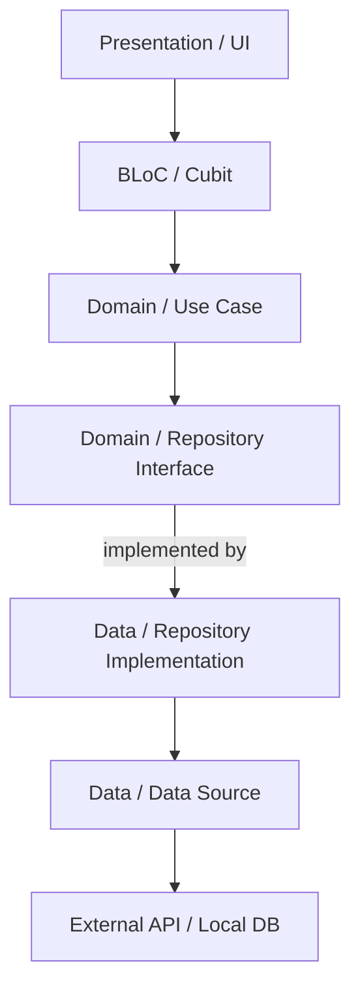
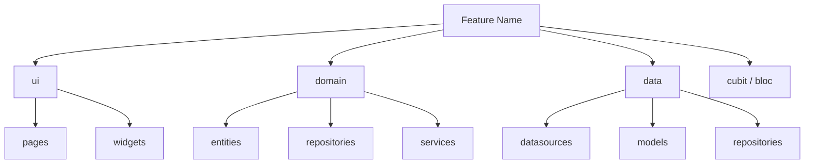
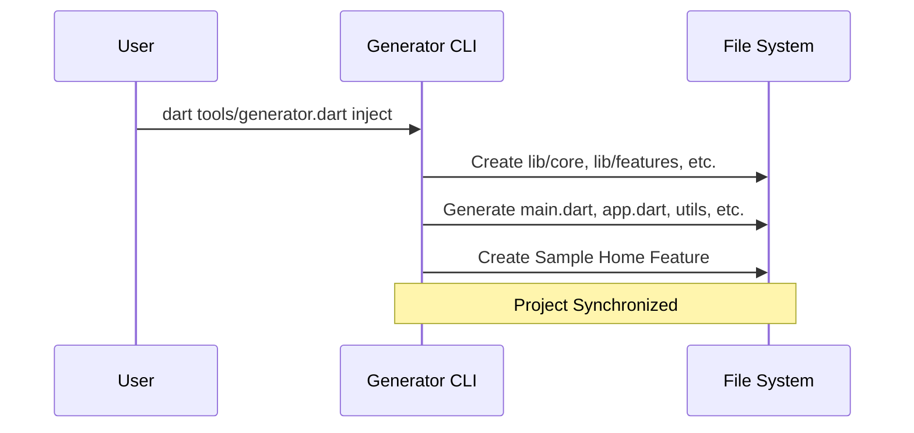

# 🚀 Flutter BLoC Clean Architecture Generator

A powerful CLI tool to scaffold Flutter projects with **BLoC pattern**, **Clean Architecture**, and **best practices** baked in. Production-ready structure with **go_router**, **Dio**, **Envied**, **Logger**, **Sizer**, and modern Flutter stack.

---

## 📦 What's Included

### **Core Architecture**
- ✅ **BLoC/Cubit** pattern with flutter_bloc
- ✅ **Clean Architecture** (Domain, Data, Presentation layers)
- ✅ **Feature-based** folder structure
- ✅ **Dependency Injection** with GetIt
- ✅ **go_router** for type-safe navigation
- ✅ **Dio** with interceptors for networking
- ✅ **Error handling** (Failure/Exception pattern)
- ✅ **Very Good Analysis** linting rules
- ✅ **fpdart** for functional error handling (Either result)

### **Production Readiness**
- 🌐 **Environment Config** with `envied` (obfuscated keys)
- 🌍 **Localization** (l10n) with ARB files (EN & ID)
- 💾 **Local Storage** wrapper for `shared_preferences`
- 📝 **Logging** with `logger` (replaces `print` in interceptors)
- 📱 **Native Scaffolding** (launcher icons & splash screen)
- 📐 **Responsive UI** with `sizer`

### **Offline-First**
- 🔄 **Drift** (SQLite) for local database
- 📡 **Connectivity detection** with auto-sync on reconnect
- ✅ **Sync indicators** per item (synced/pending)
- 🏗️ **Full BLoC + Repository + Datasource** scaffolding

### **Pre-built Components**
- 🎨 **Material 3** theming system
- 🧩 **Shared widgets**: AppButton, AppTextField, LoadingIndicator, ErrorView
- 🛠️ **Utilities**: Validators, Extensions, Constants
- 📱 **Sample feature** with full implementation
- 🔍 **BLoC observer** for debugging

---

## 🎯 Quick Start

### **1. Setup (First Time)**

```bash
# In your Flutter project root
# 1. Inject structure
dart tools/generator.dart inject

# 2. Rename project (Recommended)
dart tools/generator.dart rename my_cool_app

# 3. Setup production features
dart tools/generator.dart setup all

# 4. Create offline-first feature (optional)
dart tools/generator.dart offline notes
```

This will:
- ✅ Generate complete folder structure
- ✅ Create core files (theme, network, DI, routes)
- ✅ Add sample "home" feature as reference
- ✅ Setup shared widgets and utilities

### **2. Install Dependencies**

After injection, add these to your `pubspec.yaml`:

```yaml
dependencies:
  flutter_bloc: ^8.1.6
  equatable: ^2.0.5
  go_router: ^14.6.2
  dio: ^5.7.0
  get_it: ^9.2.0
  fpdart: ^1.2.0

  # Offline-first (if using `offline` command)
  drift: ^2.31.0
  drift_flutter: ^0.2.8
  connectivity_plus: ^7.0.0
  uuid: ^4.5.2
  path_provider: ^2.1.5

dev_dependencies:
  very_good_analysis: ^6.0.0
  build_runner: ^2.11.1

  # Offline-first (if using `offline` command)
  drift_dev: ^2.31.0
```

Then run:
```bash
flutter pub get
```

### **3. Generate Code**

If using features that require code generation (Envied, Drift), run:

```bash
dart run build_runner build --delete-conflicting-outputs
```

> [!NOTE]
> This generates `.g.dart` files for Drift tables and Envied environment config. Run this again whenever you modify Drift tables or env config.

### **4. Run Your App**

```bash
flutter run
```

---

## 📚 Usage Guide

### **Create New Feature**

Generate a complete feature module with boilerplate:

```bash
dart tools/generator.dart feature products
```

**What you get:**
```
lib/features/products/
├── cubit/
│   ├── products_list_cubit.dart      # Sample cubit with logic
│   └── products_list_state.dart      # States (Loading/Loaded/Error)
├── domain/
│   ├── entities/
│   │   └── products_entity.dart      # Domain entity
│   ├── repositories/
│   │   └── products_repository.dart  # Repository interface
│   └── services/
│       └── products_service.dart     # (Optional) Service logic
├── data/
│   ├── datasources/
│   │   └── products_remote_datasource.dart  # API calls
│   ├── models/
│   │   └── products_model.dart       # Data model with JSON
│   └── repositories/
│       └── products_repository_impl.dart # Repository implementation
└── ui/
    ├── pages/
    │   └── products_page.dart        # Full page with BlocProvider
    └── widgets/
        └── products_card.dart        # Custom widget
```

**New Automations:**
- ✅ **Route Constants**: Adds constant to `lib/routes/route_names.dart`.
- ✅ **Auto-Routing**: Automatically injects route into `lib/routes/app_router.dart` only when sample pages are created (like the home feature).
- ✅ **Page Routing**: When creating pages with `dart tools/generator.dart page`, routes are automatically injected.

### **Create Cubit (Simple State)**

For simple state management (toggles, counters, filters):

```bash
dart tools/generator.dart cubit products product_filter
```

Generates:
- `products_filter_cubit.dart`
- `products_filter_state.dart`

### **Create BLoC (Complex Flow)**

For complex business logic (auth, payment, multi-step forms):

```bash
dart tools/generator.dart bloc auth login
```

Generates:
- `login_bloc.dart`
- `login_event.dart`
- `login_state.dart`

### **Create Shared Widget**

For reusable UI components:

```bash
dart tools/generator.dart widget product_card
```

Creates: `lib/shared/widgets/product_card.dart`

### **Create Page**

For creating UI pages within features:

```bash
dart tools/generator.dart page products products_detail
```

Creates: `lib/features/products/ui/pages/products_detail_page.dart` and automatically injects route into the router.

### **Create Service**

For creating domain services in the domain layer:

```bash
dart tools/generator.dart service products analytics
```

Creates: `lib/features/products/domain/services/analytics_service.dart` with abstract interface and implementation.

### **Rename Project**

To rename the entire project (package name, imports, platform files):

```bash
dart tools/generator.dart rename my_new_app
```

**What it does:**
- ✅ Updates `pubspec.yaml`
- ✅ Refactors all Dart `package:` imports
- ✅ Updates Android `namespace` and `applicationId`
- ✅ Updates iOS `Bundle Identifier`
- ✅ Updates Web & Linux platform metadata
- ✅ Updates references in all `.md` files

### **Setup Production Features**

Automate the setup of production-ready features with a single command:

```bash
# Setup everything at once
dart tools/generator.dart setup all

# Or setup individually
dart tools/generator.dart setup env        # Environment config (Envied)
dart tools/generator.dart setup l10n       # Localization (l10n)
dart tools/generator.dart setup storage    # Local storage (SharedPreferences)
dart tools/generator.dart setup logger     # Logging system (Logger)
dart tools/generator.dart setup native     # Launcher icons & splash screen
dart tools/generator.dart setup responsive # Responsive utility (Sizer)
```

**What each setup does:**

| Feature | Files Created | Files Patched |
|---------|--------------|---------------|
| **env** | `env/.env.*`, `lib/core/config/env.dart` | `.gitignore` |
| **l10n** | `l10n.yaml`, `lib/l10n/*.arb` | `app.dart`, `pubspec.yaml` |
| **storage** | `lib/core/services/storage_service.dart` | `service_locator.dart` |
| **logger** | `lib/core/utils/logger_utils.dart` | `interceptors.dart` |
| **native** | `flutter_launcher_icons.yaml`, `flutter_native_splash.yaml` | `pubspec.yaml` |
| **responsive** | — | `app.dart` (Sizer wrapper) |

**After setup, install dependencies:**

```bash
# Dependencies
flutter pub add envied shared_preferences logger sizer
flutter pub add flutter_localizations --sdk=flutter
flutter pub add intl

# Dev Dependencies
flutter pub add --dev envied_generator build_runner
flutter pub add --dev flutter_launcher_icons flutter_native_splash

# Generate env code
dart run build_runner build --delete-conflicting-outputs

# Generate native assets (after placing images in assets/images/)
dart run flutter_launcher_icons
dart run flutter_native_splash:create
```

---

## 🏗️ Project Structure

```
lib/
├── main.dart                    # App entry point
├── app.dart                     # MaterialApp with routing
│
├── core/                        # Core functionality
│   ├── theme/                   # App theming
│   │   ├── app_theme.dart
│   │   ├── app_colors.dart
│   │   ├── app_typography.dart
│   │   └── extensions/
│   │       └── app_spacing.dart
│   ├── di/
│   │   └── service_locator.dart  # Dependency injection
│   ├── network/
│   │   ├── api_client.dart       # Dio instance
│   │   └── interceptors.dart     # Logging, Auth
│   ├── error/
│   │   ├── failure.dart          # Failure classes
│   │   └── exception.dart        # Exception classes
│   ├── config/
│   │   └── env.dart              # Environment variables (Envied)
│   ├── services/
│   │   └── storage_service.dart   # SharedPreferences wrapper
│   ├── utils/
│   │   ├── constants.dart
│   │   ├── validators.dart       # Form validators
│   │   └── logger_utils.dart     # Logger utility
│   └── extensions/
│       └── context_extension.dart
│
├── features/                    # Feature modules
│   ├── home/                    # ✅ Sample feature
│   │   ├── cubit/
│   │   ├── domain/
│   │   │   ├── entities/
│   │   │   ├── repositories/
│   │   │   └── services/
│   │   ├── data/
│   │   │   ├── datasources/
│   │   │   ├── models/
│   │   │   └── repositories/
│   │   └── ui/
│   │       ├── pages/
│   │       └── widgets/
│   ├── auth/
│   └── products/
│
├── shared/                      # Shared across features
│   ├── widgets/
│   │   ├── app_button.dart
│   │   ├── app_text_field.dart
│   │   ├── loading_indicator.dart
│   │   └── error_view.dart
│   └── blocs/
│       └── app_bloc_observer.dart
│
└── routes/                      # Navigation
    ├── app_router.dart          # go_router config
    └── route_names.dart         # Route constants
```

---

## � Architecture & Flow Diagrams

### **1. Clean Architecture Layers**
Visualizing how data flows through the application layers.



### **2. Feature Folder Structure**
Standard structure generated for every new feature.



### **3. Generator Workflow**
How the CLI tool scaffolds your project.



---

## �📖 Examples

### **Example 1: Authentication Flow**

```bash
# 1. Create auth feature
dart tools/generator.dart feature auth

# 2. Create login BLoC
dart tools/generator.dart bloc auth login

# 3. Create register BLoC
dart tools/generator.dart bloc auth register
```

### **Example 2: E-commerce App**

```bash
# Features
dart tools/generator.dart feature products
dart tools/generator.dart feature cart
dart tools/generator.dart feature checkout

# Cubits for simple state
dart tools/generator.dart cubit cart cart_items
dart tools/generator.dart cubit products product_filter

# BLoC for complex flow
dart tools/generator.dart bloc checkout payment

# Create pages for features
dart tools/generator.dart page products list
dart tools/generator.dart page products detail
dart tools/generator.dart page cart view
dart tools/generator.dart page checkout form

# Create domain services
dart tools/generator.dart service products analytics
dart tools/generator.dart service cart discount
```

### **Example 3: Social Media App**

```bash
dart tools/generator.dart feature feed
dart tools/generator.dart feature profile
dart tools/generator.dart feature messaging

dart tools/generator.dart cubit feed post_list
dart tools/generator.dart bloc messaging chat
```

---

## 🎨 How to Use Generated Code

### **1. Update Repository**

Edit `lib/features/products/data/products_repository_impl.dart`:

```dart
@override
Future<Either<Failure, List<ProductEntity>>> getProducts() async {
  try {
    final models = await remoteDataSource.getProducts();
    return Right(models.map((model) => model.toEntity()).toList());
  } on ServerException catch (e) {
    return Left(ServerFailure(e.message));
  }
}
```

### **2. Wire up in DI**

Edit `lib/core/di/service_locator.dart`:

```dart
Future<void> setupServiceLocator() async {
  // Data sources
  sl.registerLazySingleton<ProductsRemoteDataSource>(
    () => ProductsRemoteDataSourceImpl(sl()),
  );

  // Repositories
  sl.registerLazySingleton<ProductsRepository>(
    () => ProductsRepositoryImpl(sl()),
  );

  // Cubits
  sl.registerFactory(() => ProductsListCubit(sl()));
}
```

### **3. Add Route**

Edit `lib/routes/app_router.dart`:

```dart
// 🚀 Auto-injected by generator!
GoRoute(
  path: RouteNames.products,
  name: RouteNames.products,
  builder: (context, state) => const ProductsPage(),
),
```

Edit `lib/routes/route_names.dart`:

```dart
// 🚀 Auto-injected by generator!
static const String products = '/products';

```

### **4. Use in UI**

```dart
class ProductsPage extends StatelessWidget {
  @override
  Widget build(BuildContext context) {
    return BlocProvider(
      create: (context) => sl<ProductsListCubit>()..loadProducts(),
      child: Scaffold(
        appBar: AppBar(title: Text('Products')),
        body: BlocBuilder<ProductsListCubit, ProductsListState>(
          builder: (context, state) {
            if (state is ProductsListLoading) {
              return LoadingIndicator(message: 'Loading products...');
            }

            if (state is ProductsListError) {
              return ErrorView(
                message: state.message,
                onRetry: () => context.read<ProductsListCubit>().loadProducts(),
              );
            }

            if (state is ProductsListLoaded) {
              return ListView.builder(
                itemCount: state.products.length,
                itemBuilder: (context, index) {
                  return ProductCard(product: state.products[index]);
                },
              );
            }

            return SizedBox.shrink();
          },
        ),
      ),
    );
  }
}
```

---

## 🔧 Pre-built Utilities

### **Validators**

```dart
// In your form
TextFormField(
  validator: Validators.email,
),

TextFormField(
  validator: (value) => Validators.minLength(value, 8, fieldName: 'Password'),
),

TextFormField(
  validator: Validators.phone,
),
```

### **Context Extensions**

```dart
// Navigation
context.pop();

// Theme
final colors = context.colorScheme;
final textStyle = context.textTheme.titleLarge;

// Screen size
if (context.isMobile) { ... }
if (context.isTablet) { ... }

// Snackbar
context.showSnackBar('Success!');
context.showErrorSnackBar('Failed!');
context.showSuccessSnackBar('Saved!');
```

### **Shared Widgets**

```dart
// Button with loading
AppButton(
  text: 'Submit',
  onPressed: () => submit(),
  isLoading: state is Loading,
  icon: Icons.send,
)

// Text field
AppTextField(
  label: 'Email',
  hint: 'Enter your email',
  validator: Validators.email,
  keyboardType: TextInputType.emailAddress,
)

// Loading
LoadingIndicator(message: 'Processing...')

// Error
ErrorView(
  message: 'Something went wrong',
  onRetry: () => retry(),
)
```

---

## 🎯 Best Practices

### **When to Use BLoC vs Cubit**

| Use Case | Choose |
|----------|--------|
| Simple state (toggle, counter) | **Cubit** |
| Complex flow (auth, payment) | **BLoC** |
| Need event history | **BLoC** |
| Quick prototype | **Cubit** |

### **Folder Organization**

✅ **DO:** Keep features independent
```dart
// ✅ Good
import '../../../core/network/api_client.dart';
import '../../auth/domain/auth_repository.dart';
```

❌ **DON'T:** Cross-import between features
```dart
// ❌ Bad
import '../../products/data/products_model.dart'; // in cart feature
```

### **State Management Tips**

1. **Keep BLoC logic pure** - no UI references
2. **Use Equatable** for state comparison
3. **Handle all states** in BlocBuilder
4. **Close streams** properly (auto-handled by BLoC)
5. **Test your BLoCs** with bloc_test package

---

## 🚀 Advanced Usage

### **Custom API Base URL**

Edit `lib/core/network/api_client.dart`:

```dart
ApiClient() {
  _dio = Dio(
    BaseOptions(
      baseUrl: 'https://your-api.com/v1', // Change this
      connectTimeout: Duration(seconds: 30),
      // ...
    ),
  );
}
```

### **Add Auth Token**

Edit `lib/core/network/interceptors.dart`:

```dart
class AuthInterceptor extends Interceptor {
  @override
  void onRequest(RequestOptions options, RequestInterceptorHandler handler) async {
    final token = await secureStorage.read(key: 'auth_token');
    if (token != null) {
      options.headers['Authorization'] = 'Bearer $token';
    }
    super.onRequest(options, handler);
  }
}
```

### **Custom Theme Colors**

Edit `lib/core/theme/app_colors.dart`:

```dart
class AppColors {
  static const primary = Color(0xFF6200EE);    // Your brand color
  static const secondary = Color(0xFF03DAC6);  // Accent color
  // ...
}
```

---

## 📝 Commands Reference

```bash
# Initialize structure in current project
dart tools/generator.dart inject

# Create feature with boilerplate samples
dart tools/generator.dart feature <feature_name>

# Create cubit (simple state)
dart tools/generator.dart cubit <feature> <cubit_name>

# Create bloc (complex flow)
dart tools/generator.dart bloc <feature> <bloc_name>

# Create page in feature
dart tools/generator.dart page <feature> <page_name>

# Create service in feature domain layer
dart tools/generator.dart service <feature> <service_name>

# Create shared widget
dart tools/generator.dart widget <widget_name>

# Rename project and package
dart tools/generator.dart rename <new_name>

# Setup production features
dart tools/generator.dart setup all          # All features
dart tools/generator.dart setup env          # Environment config
dart tools/generator.dart setup l10n         # Localization
dart tools/generator.dart setup storage      # Local storage
dart tools/generator.dart setup logger       # Logging system
dart tools/generator.dart setup native       # Icons & splash
dart tools/generator.dart setup responsive   # Responsive UI

# Offline-first feature (Drift + BLoC + sync)
dart tools/generator.dart offline <feature_name>
```

---

## 🎓 Learning Resources

### **Official Docs**
- [BLoC Library](https://bloclibrary.dev/)
- [go_router](https://pub.dev/packages/go_router)
- [Dio](https://pub.dev/packages/dio)

### **Recommended Reading**
- [Clean Architecture by Uncle Bob](https://blog.cleancoder.com/uncle-bob/2012/08/13/the-clean-architecture.html)
- [Flutter BLoC Best Practices](https://bloclibrary.dev/#/architecture)
- [Effective Dart](https://dart.dev/guides/language/effective-dart)

---

## 🐛 Troubleshooting

### **"Not in a Flutter project directory"**
Make sure you run commands from your Flutter project root where `pubspec.yaml` exists.

### **Import errors after generation**
Run `flutter pub get` to fetch dependencies.

### **BLoC not updating UI**
Make sure your state classes extend Equatable and implement `props`.

### **Navigation not working**
Check that routes are added to `app_router.dart` and imported properly.

---

## 🤝 Contributing

Feel free to:
- Report bugs
- Suggest features
- Submit pull requests
- Share your experience

---

## 📄 License

MIT License - feel free to use in your projects!

---

## 💡 Tips & Tricks

1. **Start with sample feature** - Check `lib/features/home/` for reference
2. **Copy patterns** - Use generated code as templates
3. **Keep it simple** - Don't over-engineer, add complexity when needed
4. **Test early** - Write tests alongside features
5. **Document your code** - Future you will thank you

---

## 🎉 Happy Coding!

Built with ❤️ for the Flutter community.

For questions or support, check the sample code in `lib/features/home/`.